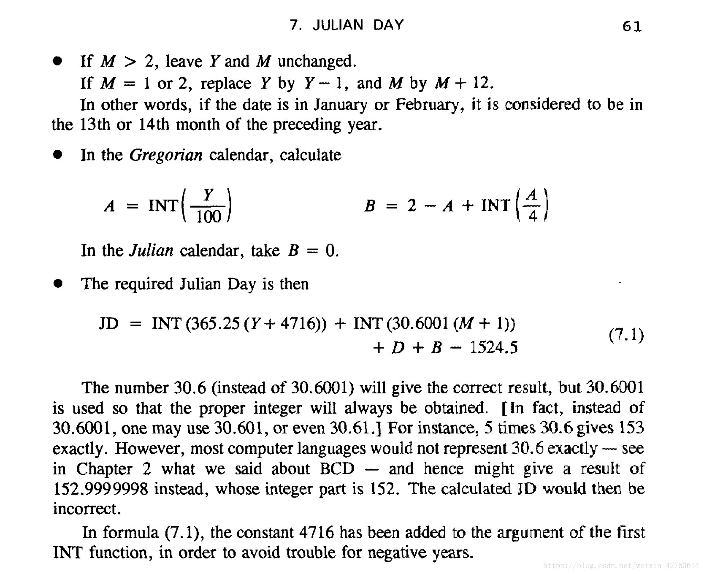
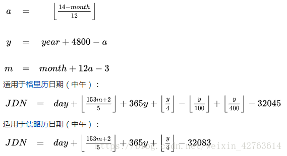
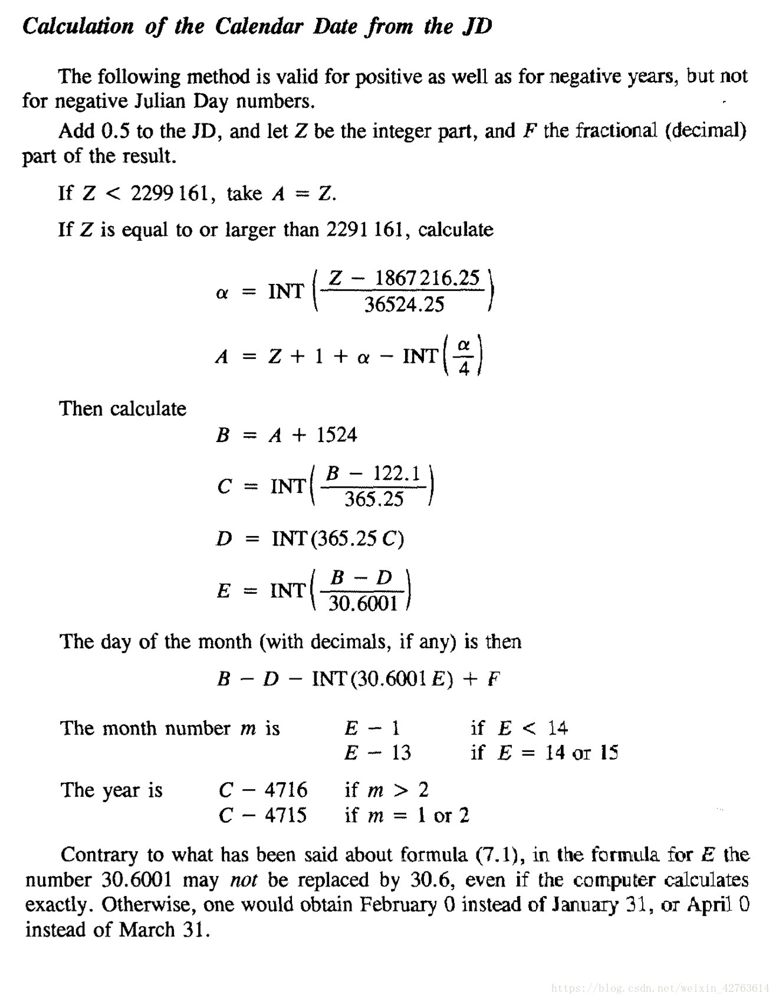

***儒略日与公历转换***

[TOC]


https://blog.csdn.net/weixin_42763614/article/details/82880007
------
# 1. 公历转儒略日

《Astronomical Algorithms》中给出了简便的计算公式[^注1]。



书中并未给出公式的含义，这里做一个分析。

## 1.1 儒略历转儒略日

若求Y年M月D日对应的儒略日，即分别对(Y-历元年)年(M-1)月D日进行积日。

**年**：由于公元纪年法没有0年，为方便计算，天文学中以0表示公元前1年，则公元前4713年表示为-4712。对儒略历而言，以365.25天为岁长，每年闰余0.25天，4年闰余积1天则需置闰。故儒略历每4年一闰。利用取整运算，可以在一个置闰周期中，对于*365.25\*(Y-x)*，每4年前3年向下取整，第四年进位。注意Y可以是任意一年，x用于将年份调节为任一置闰周期的起点。计算Y年的积日，即将从-4712年到Y年的积年乘以一回归年的长度。

> floor((Y+4712)*365.25)  [^注2]

**月**：1.公历设置大小月的基本思路是每月大小相间隔。相邻两月必为61天，如此一年共366天。平均一月为30.5天。故利用取整运算，对于每两个月的周期规律可以使用*int(30.5)，*从小月开始，为小月时取其整数，为大月时则会进位*。*这种情况下，M月（积月为M-1）的积日即为int(30.5*(M-1))。而公历以单数月为31天，双数月为30天。即岁首（M=1）时为大月，可令上式M=M+1，将该式调节到从大月起算，再减去多加的一月30，则积日为**int(30.5\*M)-30**

2. 公历一年实际只有365日，需在某月中减去一天，而公历设在二月。这时，3~12月份仍然是有规律的（大小月相隔），1月有31天，2月有29天。如此，可假设以3月份作为岁首，2月为年尾。则在2月减去的一天可理解为上年岁末（即今年岁首前）少一天。并以13、14月表示上一年的1、2月（即一年只有3~14月）。则每年仍然是单数月31天，双数月为30天，且岁首（M=3）仍为大月，则仅需令上式再减1（2月少一天）。计算M月的积日，则有：**int(30.5\*M)-31（M>2）**

该式只适用于M>2的情况，所以当为1月或2月时，可设为13、14月，即M=M+12，如此则多算一年，即令Y=Y-1。

> 一年的状况（单数月31天，双数月30天）
>
> 3月   4月  5月  6月  7月  8月  9月  10月 11月 12月  1月  2月
>
> 31天 30天 31天 30天 31天 30天 31天 30天 31天 30天 31天 30天-1

3. 对于公历，又将8月增加一天成为大月，以后9~12月则依次改变大小月顺序，而二月再减去一日成为28天。

> 一年的状况（每5个月循环）
>
> 3月   4月  5月  6月  7月  8月  9月  10月 11月 12月  1月  2月
>
> 31天 30天 31天 30天 31天 31天 30天 31天 30天 31天 31天 30天-2

如此，7、8成为连大月，12、13也是连大月。其中8月与岁首相差5月，13月与8月也相差5月。此时的每月的大小顺序仍然存在某种规律，即每连续5月，大小月按大小大小大循环排序。亦即连续5月的积月为153天（3大2小），平均每月为30.6天。则M月的积日为int(30.6*M)-31，由于该式是以3月为岁首，需调整月份，即令M=M+1，再减去多算的一月30，并需减去2月再减少的1天则有：

> int(30.6*(M+1))-62 （M>2）

**日**：由于儒略日的历元是以正午12时开始（记为0.0），而公历一日之始以半夜12时开始（记为1.0），两种相差0.5天，则对日的积日为实际日数-1.5

> D - 1.5

将儒略历转换为儒略日，仅需将年月日的积日相加，有：

> floor(365.25*(Y+4712))+int(30.6*(M+1))+D-63.5 （M>2）
>
> 当M<=2时：令Y = Y - 1，M = M + 12，可适用该公式


## 1.2 格里高利历转儒略日

**闰**：儒略历每400年百闰。而在1582年发现春分点与实际相差10日（岁差22日，而儒略历回归年长度较实际值为大，多计算了12天）。故以是年10月4日的次日实行新历（格里高利历），历元为1582年10月15日，有10日之差。新历重新测定了回归年长度并考虑了岁差，岁长改为365.2425，即每400年少3日，合400年97闰。故计算格里高利历的儒略日，还需在上式中减去不置闰（能被100整除，但不含能被400整除的年份）的日数，即为-floor((Y-1582)/100)+floor((Y-1582)/400)-10，为简便算法，假设历元为0年，则自0年至1582年少算了不置闰的日数共12天，需加上，则计算格里历的儒略日数需减去不置闰的日数：

> -floor(Y/100)+floor(Y/400)+2

最终有格里高利历转儒略日的公式：

> floor(365.25*(Y+4712)) + int(30.6*(M+1)) + D - floor(Y/100)+floor(Y/400)+2 - 63.5 （M>2）
>
> 当M<=2时：令Y = Y - 1，M = M + 12，可适用该公式

### 补充说明

（1）上式的floor()函数表示向下取整，而书中使用的是的int()函数（实际在作者写作的年代它仍表示向下取整，详见注2[^注2]），在现代编程语言中它的意义是取整，对于负数运算，如int(-365.25)值为-365而非366。考虑到当计算-4712年3月1日之前的数据时，Y=Y-1即-4713年，对年的积日运算中出现对负数取整的情况。故将历元推到前一个置闰年即-4716年以避免对负数的取整运算，此时多加了4年，需要在式尾中减去1461天。

（2）同样考虑计算机对浮点数计算精度的问题，因为计算机对十进制的表示和计算是以二进制进行的，无法得到精确值。故以30.6001替代30.6以避免出现计算误差。（原书的写作时间为上世纪90年代，计算精度有限，现代计算机中使用双精度浮点数，可以直接用30.6而不会出现计算误差。）

对此二者做出修正后，则有：

> JD = floor(365.25*(Y+4716)) + int(30.6001*(M+1)) + D + B - 1524.5 （M>2）
>
> 当M<=2时：令Y = Y - 1，M = M + 12，可适用该公式
>
> 对儒略历（公元前1582年10月4日及以前），有B = 0
>
> 对格里高利历（公元前1582年10月15日及以后），有B = 2 - floor(Y/100)+floor(Y/400)

但对计算机而言，该式仍然不适用于计算-4716年3月1日前的儒略日数（但可以计算从儒略日历元开始的任意一天的儒略日数）。若使用向下取整函数替换int()，则该式可使用于任意一天的儒略日计算，且不必做历元调整。

此式即可避免出现计算机取整运算与实际不一致的情况，从而避免因不同编程语言出现的计算误差。

（3）wiki中提供了另一个公式，其实质与上式相同。[^注3]



以3月为岁首，每5个月符合大小大小大的顺序，合计153天，平均每月30.6天。而计算起点为大月，需加上0.4，取整后方得31。故有m月的积日为floor((153m+2)/5)。每年以365计，则需加上置闰年floor(y/4)（365y+floor(y/4)等价于floor(365.25y)）。式中将历元前推到原历元上一个格里历置闰周期起点的年份-4800（公元前4801年1月1日）0时，则需在末尾减去(4800-4712)*365.25即32142天，还需再补上1月和2月合计59天，得32083日。对格里历还需补上自-4712年至1582年少置闰的年份，共48天，减去上岁差和回归年过大引起的误差共10天。

注意这里是计算JDN的表达式，它与JD的关系是

> JDN = floor(JD + 0.5)

儒略日数的计算公式还有很多，但思路类似，不再举例说明。

## 1.3 简化儒略日

为简化儒略日的表示，国际天文联合会决定行用简化儒略日，并定义为

> MJD = JD -2400000.5

根据儒略日转公历的计算函数，可得MJD的的起点为儒略日2400000.5，即公元1858年11月17日世界时0时。

## 1.4 儒略日计算的python实例

```python
import math

from datetime import *


def ce2jd(Year,Month,D):
    if Month in [1,2]:
        M = Month + 12
        Y = Year - 1
    else:
        Y = Year
        M = Month

    B = 0
    if Y>1582 or (Y==1582 and M>10) or (Y==1582 and M==10 and D>=15):
        B = 2 - int(Y/100) + int(Y/400)  #公元1582年10月15日以后每400年减少3闰

    JD = math.floor(365.25*(Y+4716))+int(30.6*(M+1))+D+B-1524.5
    #JD = math.floor(365.25*(Y+4712))+int(30.6*(M+1))+D+B-63.5

    print("{}年{}月{}日的儒略日为：{:.5f}".format(gyjn(Year),Month,D,JD))

    if Y>1858 or (Y==1858 and M>11) or (Y==1858 and M==11 and D>=17):
        MJD = int(JD - 2400000.5)
        print("简化儒略日为：{}".format(MJD))

    return JD


if __name__ == "__main__":
    #示例：计算当前时间的儒略日
    year = datetime.now().year
    month = datetime.now().month
    day = datetime.now().day

    ce2jd(year,month,day)

```

程序使用了一个将天文计算年份表达为公元纪年法年份的函数：

```python
def gyjn(year):
    if year > 1:
        ce = "公元" + str(year)
    elif year == 1:
        ce = "公元元"
    elif year <= 0:
        year -= 1
        ce = "公元前" + str(-year)

    return ce
```

该程序没有对1582年10月5日至14日这失去的10日进行处理，如果输入这10日，其计算结果与10月15日至24日相同。如果需要获取用户输入，应给出相应的错误提示。


# 2. 儒略日转公历

儒略日转公历即将上述表达式作为方程，进行求解。

《Astronomical Algorithms》同一章节给出了求算方法。这里分别说明每一个表达式的含义。



## 2.1 计算分析

1. 由于儒略日的历元为正午12时，公历历元为半夜12时，为统一计算，将儒略历历元前推至0.5日。即为：JD = JD + 0.5
2. 其中整数部分为日数，小数部分为时刻，只对整数部分进行运算。则令：

> Z = floor(JD)
> 
> F = JD - Z

Z即为所求日到-4712年1月1日0时的日数。

3. 由于儒略历和格里历的岁长不同，需分别处理。即自1582年10月15日0时前适用儒略历（岁长365.25），此后适用格里历（岁长365.2425）。为统一计算，可将格里历转换为儒略历，即假设自-4712年1月1日0时起一直使用的是儒略历。则针对格里历相对儒略历少置闰（400年3闰）的部分给予补上。对于使用取整公式计算置闰，只能以一个400年置闰周期的起点为岁首，如1600年3月1日，根据儒略日计算公式，得该日的儒略日为2305507.5。

格里历除能被400整除的百年为36525日外，其余每百年仅36524日，此时分母较大，故分子每百年应增加0.25日，300年计0.75日。前对JD取整后所得Z值，仍以12时为历元，故仅需再增0.25日。

> a = floor((Z - 2305507.25) / 36524.25)

再补上1582年10月4日到10月15日跳过的10天，即为自-4712年1月1日0时到所求日以儒略历计算的总积日。

> A = Z + 10 + a - floor(a/4)

（注：书中a和A的表达式与此略有差异，是由于书中将历元推至公元元年1月1日，则至1582年间多置闰了12次，去除跳过的10天，共多了2日，反映在置闰公式中，相当于多计算了200年，由于在置闰公式（floor(y/100)-floor(y/400)）中，对200年间的置闰可能有2次或1次2种情况，宜推算到一次置闰周期即400年，则必然置闰3次，而多算了一次，则在表达式A中补足。即为调整"儒略历和格里历的置闰误差"以及"不识岁差和回归年过大的误差"再次将历元从公元元年推至公元400年。这种情况思虑比较复杂，可不使用书中的表达式。）

同样地，为避免对负数取整的情况，将历元前推至-4716年3月1日0时，需补上相差的日数，合1524日。即有：

> B = A + 1524

对所得的积日（儒略历），除以岁长，即为积年（表达式C），加上历元即为所求公历年份。其中整数部分为年的积日（表达式D），小数部分为月与日的积日（表达式B-D）。

> C = floor((B-122.1)/365.25)
>
> D = floor(365.25*C)

将B-D除以每月平均日数30.6为积月（表达式E），其中整数部分为月数，小数部分为日数（day）。

最后调整岁首的情况可得month和year。

宜需考虑，day的结果小于0.5时，即在上月末日，此时亦可能导致E值小于1，即在上年末月。需要分别判断处理。但也可先求JD-1日，得到正常结果，在结果上加回减去的1日即可。

## 2.2 已知儒略日求公历的python实例

```python
def jd2ce(JD):
	JD = JD + 0.5  # 以BC4713年1月1日0时为历元
	Z = math.floor(JD)
	F = JD - Z  # 日的小数部分

	if Z < 2299161:  # 儒略历
		A = Z
	else:  # 格里历
		a = math.floor((Z - 2305507.25) / 36524.25)
		A = Z + 10 + a - math.floor(a/4)

	k = 0

	while True:
		B = A + 1524  # 以BC4717年3月1日0时为历元
		C = math.floor((B-122.1)/365.25)  # 积年
		D = math.floor(365.25 * C)  # 积年的日数
		E = math.floor((B-D)/30.6)  # B-D为年内积日，E即月数
		day = B - D - math.floor(30.6*E) + F
		if day >= 1: break  # 否则即在上一月，可前置一日重新计算
		A -= 1
		k += 1

	month = E - 1 if E < 14 else E - 13
	year = C - 4716 if month > 2 else C - 4715
	day += k
	if int(day) == 0:
        day += 1

	ce = gyjn(year)
	print("儒略日{}对应的公历日期为{}年{}月{}日".format(JD-0.5,ce,month,day),'\n')

	return year, month, day


if __name__ == "__main__":
    # 计算示例
    jd2ce(2400000.5)    # print：1858年11月17.0日（简化儒略日历元） 
    jd2ce(2299160.5)    # print：1582年10月15.0日（格里历历元）
    jd2ce(2299160.5-1)  # print：1582年10月4.0日（儒略历最后一日）

```

注意：返回的year是天文计算年而不是公历年，如-1000表示公元前1001年。也可以再利用上述公元纪年表达函数进行输出。


测试以上两个程序，可用以下代码：

> jd2ce(ce2jd(year, month, day))

对于任意的year,month,day，输出值与输入值相同，可以证明两个程序的正确性，不必分别测试。


# 3. 时间转换

## 3.1 24小时制

以上计算获得的day含有小数，即该日的具体时间。一分钟60秒，一小时3600秒，一日86400秒。简单的做法是，先将小数转为秒数，整除3600即小时数，余数再整除60即分钟数。

但是，如果day的精度要求较高，就必须考虑每次加减乘除对不确定尾数的影响，

```python
def day2hms(day):
    """12h起算的日数转时分秒"""
    day += 0.5
    d = day - math.floor(day)  # 取出一日的小数部分
    h = int(d * 24)
    m = int(round((d * 24 - h) * 60, 4))

    if m == 60:
        m = 0
        h += 1

    s = d * 86400 - h * 3600 - m * 60
    if abs(s) < 0.001:
        s = 0

    return h, m, round(s, 2)
```

测试两个特殊日期，-1095.499999999与-1095.500000001

使用jd2ce()和day2hms()分别计算年月日和时分秒，如果使用简单方法，结果分别是-4715年1月1日0时0分0秒和-4716年12月31日0时0分0秒，显然二者相差应该不足1秒。

处理后的程序方可得到正确结果。

如果返回的h是24，表示实际已经是第二天，应该将h改为0，而日期多加一天。因为如开篇所言，历法的本质是积日，历法转换，通常是日的转换，而不去考虑时间。2000年1月1日24:00和2000年1月2日00:00易导致不同的结果。比如在干支纪日的历法中，前者被写作戊午日，而后者是己未日。

加一天后又必须考虑月底甚至年底跨月或跨年的情况，所以应该放到前面jd2ce()函数中处理，方法是在该函数中判断循环退出的条件上一行（第20行前）增加如下代码：

```python
# 当夜24点，实为第二日0点
if day2hms(F)[0] == 24:
	A += 1
	F = 0
	continue
```

原理与前面先求JD-1日类似，这里是求JD+1日。

## 3.2 12时辰制

中国古代将一天分为十二时辰，以地支命名，后又在每个时辰内各分初和正。但时辰的起点子初为23点并非一日的起点24/0点。同时，除梁实行96刻制及清实行120刻制外，一般使用的是百刻制，并不能被12整除。故日转为时辰时，需将一日的起点转为23点，且不能直接在时辰内分刻。而需从日数转为刻数，再减去已有时辰的刻数。

由于转换为时辰时起点并非跨日的24点，故而无需考虑临界情况。

```python
dizhi = ["子","丑","寅","卯","辰","巳","午","未","申","酉","戌","亥"]
ke = ['初', '一', '二', '三', '四']


def day2sk(JD):
    """0h起算的日数转古时刻（百刻制）"""
	d = JD - math.floor(JD)  # 取出一日的小数部分（<0.0000001超过输出位数）
	chen = round(d * 12 + 0.5, 14)  # 时辰从上一日23时起
	chen_h = int(chen)
	chen_k = round(d * 100 - int(d * 12) * 100 / 12, 14)  # 该时辰内的刻数

	if chen_k < 100 / 24:
		shike = dizhi[chen_h % 12] + '正' + ke[int(chen_k)] + '刻'
	else:
		chen_k -= 100 / 24
		shike = dizhi[chen_h % 12] + '初' + ke[int(chen_k)] + '刻'

	return shike
```

## 3.3 地方时

对于天文计算，其结果一般以UT为标准。如果用于中国历法的计算，需要转换为UT+8h。

亦即东八区某一日的开始即半夜0h，实际在格林尼治地方时上一日的16h。

而如果用于不同历法的转换，需注意两个历法之间的地方性。


[^注1]: Jean Meeus《Astronomical Algorithms》2nd，p59-66.

[^注2]: 计算机中，常用floor()表示向下取整函数，int()表示取整函数。在函数内参数小于0的情况下，int()无法代替floor()使用。如对于-1.5运用两个函数进行计算，有： floor(-1.5) = -2， int(-1.5) = -1。书中使用的是int()函数，因为该书写作较早，使用的是BASIC语言，不区分int()和floor()，直接以int()作为向下取整函数。如果用现在常见的编程语言编写，仍使用该函数，易导致公式不适用于计算历元（-4716年）前的日期。故本文在公式中改用了floor()函数，这在常见编程语言中自带的标准库math中都含有。
[^注3]: https://zh.wikipedia.org/wiki/%E5%84%92%E7%95%A5%E6%97%A5
[^注4]: 历元即历法计算的起点。通过修改历元以简便计算是历法中的基本思想，也是本文计算的重要方法。
[^注5]: 几个类似术语辨析：

1. Julian Day：儒略日，天文中用于连续纪日的历法，历元为公元前4713年1月1日12时。
2. Julian Date（JD）：儒略日，特指某时的瞬时时刻，如12:00:00可能为00秒-01秒之间或00秒这一时刻，此处特指后者。常转为日的小数表示。小数部分表示自某日12时至次日12时过去的日数。
3. Julian Day Number（JDN）：儒略日数。一定是整数，它表示某日距JD历元日相差的日数部分。可以理解为历元即公元前4713年1月1日0时。二者关系为JDN = floor(JD+0.5)
4. Julian Calendar：儒略历，它与儒略日实际没有直接关系。历元为公元前45年1月1日夜半12时，岁长为365.25日，平年365日，每4年置闰1日。儒略历施行早期，出现过多次误闰。但现代在对于格里历历元（公元1582年10月4日）前的公历，适用儒略历的一般规则，即既不依照历史误闰，也适用于表示儒略历历元前的日期。而部分国家或地区在儒略历废除后仍然使用了一段时间的儒略历。
5. Gregorian Calendar：格里高利历，即现行公历。它在儒略历的基础上修正了回归年长度，历元为公元1582年10月15日夜半12时，岁长为365.2425日。平年365日，每4年置闰1日，每400年少闰3日。格里历制定时，儒略历较格里历短10日，此10日被跳过，故公历中1582年10月4日的次日为10月15日。至今年（2018年），已短13日。