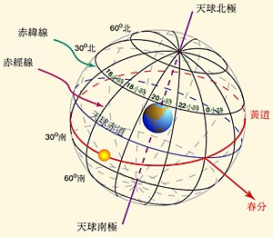
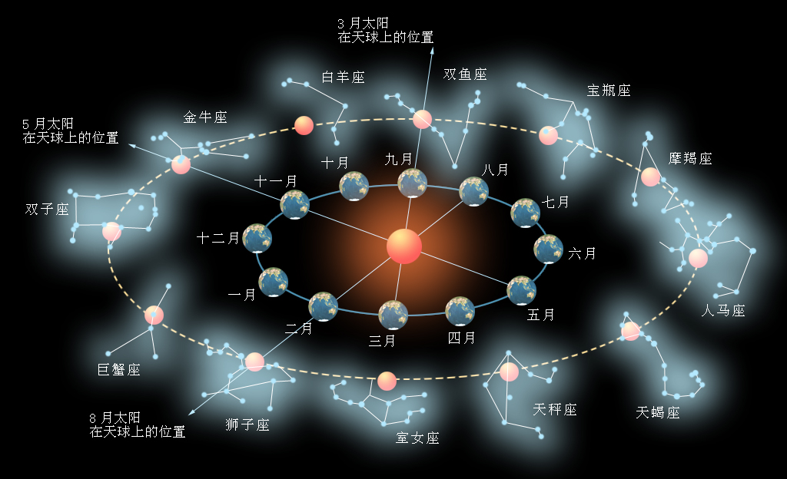

二十四节气在中国古代历法中扮演着非常重要的角色，本文将介绍二十四节气的基本知识，以及如何使用VSOP82/87行星运行理论计算二十四节气发生的准确时间。

中国古代历法都是以月亮运行规律为主，严格按照朔望月长度定义月，但是由于朔望月长度和地球回归年长度无法协调，会导致农历季节和天气的实际冷暖无法对应，因此聪明的古人将月亮运行规律和太阳运行规律相结合制定了中国农历的历法规则。在这种特殊的阴阳结合的历法规则中，二十四节气就扮演着非常重要的作用，它是联系月亮运行规律和太阳运行规律的纽带。正是由于二十四节气结合置闰规则，使得农历的春夏秋冬四季和地球绕太阳运动引起的天气冷暖变化相一致，成为中国几千年来生产、生活的依据。

二十四节气起源于中国黄河流域。远在春秋时代，古人就开始使用仲春、仲夏、仲秋和仲冬四个节气指导农耕种植。后来经过不断地改进与完善，到秦汉年间，二十四节气已经基本确立。公元前 104年，汉武帝颁布由邓平等人制定的《太初历》，正式把二十四节气订于历法，明确了二十四节气的天文位置。二十四节气天文位置的定义，就是从太阳黄经零度开始，沿黄经每运行15度所经历的时日称为“一个节气”。太阳一个回归年运行360度，共经历24个节气，每个公历月对应2个节气。其中，每月第一个节气为“节令”，即：立春、惊蛰、清明、立夏、芒种、小暑、立秋、白露、寒露、立冬、大雪和小寒等12个节令；每月的第二个节气为“中气”，即：雨水、春分、谷雨、小满、夏至、大暑、处暑、秋分、霜降、小雪、冬至和大寒等12个中气。“节令”和“中气”交替出现，各历时15天，人们习惯上把“节令”和“中气”统称为“节气”。

为了更好地理解二十四节气的天文位置，首先要解释几个天文学概念。“天球”是人们为了研究天体的位置和运动规律而引入的一个假象的球体，根据观察点（也就是球心）的位置不同，可分为“日心天球”、“地心天球”等等。图（1）就是天球概念的一个简单示意图：



图（1）天球概念示意图

 

天文学中常用的一个坐标体系就是“地心天球”，它与地球同心且有相同的自传轴，理论上具有无限大的半径。地球的赤道和南北极点延伸到天球上，对应着天赤道和南北天极点。和地球上用经纬度定为位置一样，天球也划分了经纬度，分别命名为“赤经”和“赤纬”，地球上的经度用的是度（分秒）为单位，赤经以时（分秒）为单位。天空中的所有天体都可以投射到天球上，用赤经和赤纬定为天体在天球上的位置。“黄道（Ecliptic）”是地球绕太阳公转轨道的轨道平面与天球（地心天球）相交的大圆，由于地球公转受月球和其它行星的摄动，地球的公转轨道并不是严格的平面，因此黄道的严格定义是：地月系质心绕太阳公转的瞬时平均轨道平面与天球相交的大圆。黄道和天赤道所在的两个平面并不是重叠的，它们之间存在一个23度26分的交角，称为“黄赤交角”。由于黄赤交角的存在，黄道和天赤道就在天球上有两个交点，这两个交点就是春分点和秋分点。在天球上以黄道为基圈可以形成黄道坐标系，在黄道坐标系中，也使用了经纬度的概念，分别称为“黄经”和“黄纬”。天体的黄经从春分点起沿黄道向东计量，春分点是黄经0度，沿黄道一周是360度，使用的单位是度、分和秒。黄纬以黄道测量平面为准，向北记为0度到90度，向南记为0度到-90度。

黄道平面可以近似理解为地球绕太阳公转的平面，以黄道为基圈的黄道坐标系根据观测中心是太阳还是地球还可以区分为日心坐标系和地心坐标系，对应天体的黄道坐标分别被称为“日心黄经、日心黄纬”和“地心黄经、地心黄纬”。日心黄经和日心黄纬比较容易理解，因为太阳系的行星都是绕太阳公转，以太阳为中心将这些行星向天球上投影是最简单的确定行星位置关系的做法。但是人类自古观察太阳的周年运动，都是以地球为参照，以太阳的周年视运动位置来计算太阳的运行轨迹，使用的其实都是地心黄经和地心黄纬，要了解古代历法，理解这一点非常重要。图（2）就解释了造成这种视觉错觉的原因：



图（2）太阳黄道视觉位置原理图


古人定义二十四节气的位置，是太阳沿着黄道运行时的视觉位置，每个节气对应的黄道经度其实是地心黄经。从图（2）可以看出日心黄经和地心黄经存在180度的转换关系，同样可以理解，日心黄纬和地心黄纬在方向上是反的，因此可以很方便地将两类坐标相互转换，转换公式是：
$$
太阳地心黄经 = 地球日心黄经 + 180° \tag{公式1}
$$

$$
太阳地心黄纬 = -地球日心黄纬 \tag{公式2}
$$


​    

了解了以上的天文学基础之后，就可以着手对二十四节气的发生时间进行计算。我们常说的节气发生时间，其实就是在太阳沿着黄道做视觉运动过程中，当太阳地心黄经等于某个节气黄经度数时的那个瞬间的时间。所谓的用天文算法计算二十四节气时间，就是根据牛顿力学原理或开普勒三大行星定律，计算出与历法密切相关的地球、太阳和月亮三个天体的运行轨道和时间参数，以此得出当这些天体位于某个位置时的时间。这样的天文计算需要计算者有扎实的微积分学、几何学和球面三角学知识，令广大天文爱好者望而却步。但是随着VSOP-82/87行星理论以及ELP-2000/82月球理论的出现，使得天文计算变得简单易行，本文就是以VSOP-82/87行星理论为计算依据，计算二十四节气的准确时间。

古代天文学家在对包括地球和月亮在内的行星运行轨道精确计算后发现，天体的运行因为受相近天体的影响，并不严格遵循理论方法计算出来的轨道，而是在理论轨道附近波动。这种影响在天文学上被称为摄动，摄动很难被精确计算，只能根据经验估算。但是经过长期的观测和计算，天文学家发现行星轨道因为摄动影响而产生的波动其实也是有规律的，即在相当长的时间内呈现出周期变化的趋势。于是天文学家开始研究这种周期变化，希望通过一种类似曲线拟合的方法，对一些周期计算项按照某种计算式迭代求和计算代替积分计算来模拟行星运行轨迹。这种计算式可以描述为：a + bt + ct2 + … xcos(p + qt + rt2 + …)，其中t是时间参数，这样的理论通常被称为半解析（semi-analytic）理论。其实早在十八世纪，欧洲学者Joseph Louis Lagrange就开始尝试用这种周期项计算的方法修正行星轨道，但是他采用的周期项计算式是线性方程，精度不高。

1982年，P.Bretagnon公开发表了VSOP行星理论（这个理论的英文名称是：Secular Variations of the Planetary Orbits，VSOP的缩写其实是源于法文名称：Variations Séculaires des Orbites Planétaires），VSOP理论是一个描述太阳系行星轨道在相当长时间范围内周期变化的半分析（semi-analytic）理论。VSOP82理论是VSOP理论的第一个版本，提供了对太阳系几大行星位置计算的周期序列，通过对周期序列进行正弦或余弦项累加求和，就可以得到这个行星在给定时间的轨道参数。不过VSOP82由于每次都会计算出全部超高精度的轨道参数，这些轨道参数对于历法计算这样的民用场合很不适用。1987年，Bretagnon 和 Francou 创建了VSOP87行星理论，VSOP87行星理论不仅能计算各种精密的轨道参数，还可以直接计算出行星的位置，行星位置可以是各种坐标系，包括黄道坐标系。VSOP87行星理论由6张周期项系数表组成，分别是VSOP87、VSOP87A、VSOP87B、VSOP87C、VSOP87D和VSOP87E，其中VSOP87D表可以直接计算行星日心黄经（L）、日心黄纬（B）和到太阳的距离（R），此表计算出的结果适用于节气位置判断。

VSOP87D表包含了三部分数据，分别是计算行星日心黄经的周期项系数表（L表）、计算行星日心黄纬的周期项系数表（B表）和计算行星和太阳距离的周期项系数表（R表）。VSOP87D表有太阳系8大行星的数据，本文的计算只关心与地球相关的数据。L表由L0－L5六部分组成，每一部分都包含若干个周期项系数条目，比如L0表有559个周期项系数条目，L1表有341个条目等等。L表的每个周期项系数条目包含若干个参数，用于计算各种轨道参数和位置参数，计算地球的日心黄经只需要用到其中三个系数。计算所有的周期项系数并不是必须的，有时候减少一些系数比较小的周期项可以减少计算所花费的时间，当然，这会牺牲一点精度。假设计算地球日心黄经的三个系数是A、B和C，则每个周期项的计算表达式是：
$$
A * cos(B + C*τ) \tag{公式3}
$$
其中τ是儒略千年数，τ的计算公式如下：
$$
τ = (JDE - 2451545.0) / 365250 \tag{公式4}
$$
JDE是计算轨道参数的时间，单位是儒略日，2451545.0是公元2000年1月1日 12时的儒略日数，关于儒略日的概念，请参考“日历生成算法”的第一篇《中国公历（格里历）》中的说明以及计算方法。以L0表的第二个周期项为例，这个周期项数据中与日心黄经计算有关的三个系数分别是`A= 3341656.456`，`B=4.66925680417`，`C=6283.07584999140`，则第二个周期项的计算方法是：`3341656.456 * cos(4.66925680417 + 6283.0758499914 * τ)`。对L0表的各项分别计算后求和可得到L0表周期项总和L0，对L表的其它几个部分使用相同的方法计算周期项和，可以得到L1、L2、L3、L4和L5，然后用用3.5式计算出最终的地球日心黄经，单位是弧度：
$$
L = (L_0 + L_1 * τ+ L_2 * τ^2 + L_3 * τ^3 + L_4 * τ^4 +L_5 * τ^5) / 10^8 \tag{公式5}
$$


用同样的方法对地球日心黄纬的周期项系数表和计算行星和太阳距离的周期项系数表计算求和，可以得到地球日心黄纬B和日地距离R，B的单位是弧度，R的单位是天文单位（AU）[1]。由于3.5式的计算方法需要多次计算τ的乘方，浮点数的乘方计算的速度比较慢，实际计算时，通常对3.5式进行变换，用乘法和加法代替直接的乘方计算，这是一种常用的转换：


$$
L = (((((L_5 * τ + L_4) * τ + L_3) * τ + L_2) * τ + L_1) * τ + L_0) / 10^8 \tag{公式6}
$$


本文就是使用3.6式代替3.5式进行计算。

VSOP82/87行星理论中的周期项系数对不同的行星具有不同的精度，对地球来说，在1900-2100年之间的200年跨度期间，计算精度是0.005"。前文曾说过，对于不需要这么高精度的计算应用时，可以适当减少一些系数比较小的周期项，减少计算量，提高计算速度。Jean Meeus在他的《天文算法》一书中就给出了一套精简后的VSOP87D表的周期项，将计算地球黄经的L0表由原来的559项精简到64项，计算地球黄纬的B0表甚至被精简到只有5项，从实际效果看，计算精度下降并不多，但是极大地减少了计算量。

使用VSOP87D周期项系数表计算得到的是J2000.0平黄道和平春分点（mean dynamic ecliptic and equinox）为基准的日心黄经（L）和日心黄纬（B），其值与标准FK5系统略有差别，如果对精度要求很高可以采用下面的方法将计算得到的日心黄经（L）和日心黄纬（B）转到FK5系统[2]：

首先然后 L'，单位是度：
$$
L' = L - 1.397 * T - 0.00031 * T^2 \tag{公式7}
$$


3.7式中的T是儒略世纪数，它与儒略千年数τ的关系是：T = 10 *τ。然后使用L'计算L和B的修正值ΔL和ΔB：
$$
ΔL = -0.09033 + 0.03916 * ( cos(L') + sin(L') ) * tan(B) \tag{公式8}
$$

$$
ΔB = 0.03916 * ( cos(L') - sin(L')) \tag{公式9}
$$


 ΔL和ΔB的单位都是"，是度分秒角度单位体系，需要将3.6式计算出得L和B转换成以度（°）为单位的值后再进行修正。

​    CalcSunEclipticLongitudeEC()函数就是使用VSOP87行星理论计算行星日心黄经的代码实现，整个计算过程和前文描述一样，首先根据VSOP87D表的数据计算出L0-L5，然后用3.6式计算出地球的日心黄经，3.6式计算出来的单位是弧度，因此转换成度分秒单位，最后使用3.1式将结果转换成太阳的地心黄经：

```c
double CalcSunEclipticLongitudeEC(double dt) {
    double L0 = CalcPeriodicTerm(Earth_L0, sizeof(Earth_L0) / sizeof(VSOP87_COEFFICIENT), dt);
    double L1 = CalcPeriodicTerm(Earth_L1, sizeof(Earth_L1) / sizeof(VSOP87_COEFFICIENT), dt);
    double L2 = CalcPeriodicTerm(Earth_L2, sizeof(Earth_L2) / sizeof(VSOP87_COEFFICIENT), dt);
    double L3 = CalcPeriodicTerm(Earth_L3, sizeof(Earth_L3) / sizeof(VSOP87_COEFFICIENT), dt);
    double L4 = CalcPeriodicTerm(Earth_L4, sizeof(Earth_L4) / sizeof(VSOP87_COEFFICIENT), dt);
    double L5 = CalcPeriodicTerm(Earth_L5, sizeof(Earth_L5) / sizeof(VSOP87_COEFFICIENT), dt);

    double L = (((((L5 * dt + L4) * dt + L3) * dt + L2) * dt + L1) * dt + L0) / 100000000.0;

    /*地心黄经 = 日心黄经 + 180度*/
    return (Mod360Degree(Mod360Degree(L / RADIAN_PER_ANGLE) + 180.0));
}
```

Mod360Degree()函数将大于360°或小于0°的值调整到0－360°之间，便于转换显示。CalcPeriodicTerm()函数使用3.3式对一个周期项系数表进行求和计算，可以指定需要计算的周期项数：

```c
double CalcPeriodicTerm(const VSOP87_COEFFICIENT *coff, int count, double dt) {

    double val = 0.0;

    for(int i = 0; i < count; i++) {
        val += (coff[i].A * cos((coff[i].B + coff[i].C * dt)));
    }

    return val;
}
```

同样的方法计算太阳的地心黄纬：

```c
double CalcSunEclipticLatitudeEC(double dt) {

    double B0 = CalcPeriodicTerm(Earth_B0, sizeof(Earth_B0) / sizeof(VSOP87_COEFFICIENT), dt);
    double B1 = CalcPeriodicTerm(Earth_B1, sizeof(Earth_B1) / sizeof(VSOP87_COEFFICIENT), dt);
    double B2 = CalcPeriodicTerm(Earth_B2, sizeof(Earth_B2) / sizeof(VSOP87_COEFFICIENT), dt);
    double B3 = CalcPeriodicTerm(Earth_B3, sizeof(Earth_B3) / sizeof(VSOP87_COEFFICIENT), dt);
    double B4 = CalcPeriodicTerm(Earth_B4, sizeof(Earth_B4) / sizeof(VSOP87_COEFFICIENT), dt);

    double B = (((((B4 * dt) + B3) * dt + B2) * dt + B1) * dt + B0) / 100000000.0;

    /*地心黄纬 = －日心黄纬*/
    return -(B / RADIAN_PER_ANGLE);
}
```
AdjustSunEclipticLongitudeEC()函数根据3.8式计算黄经的修正量，longitude和latitude参数是由VSOP87理论计算出的太阳地心黄经和地心黄纬，单位是度，dt是儒略千年数，返回值单位是度：

```c
double AdjustSunEclipticLongitudeEC(double dt, double longitude, double latitude) {
    //T是儒略世纪数
    double T = dt * 10; 
    double dbLdash = longitude - 1.397 * T - 0.00031 * T * T;

    // 转换为弧度
    dbLdash *= RADIAN_PER_ANGLE;

    return (-0.09033 + 0.03916 * (cos(dbLdash) + sin(dbLdash)) * tan(latitude * RADIAN_PER_ANGLE)) / 3600.0;
}
```


经过上述计算转换得到坐标值是理论值，或者说是天体的几何位置，但是FK5系统是一个目视系统，也就是说体现的是人眼睛观察效果（光学位置），这就需要根据地球的物理环境、大气环境等信息做进一步的修正，使其和人类从地球上观察星体的观测结果一致。

首先需要进行章动修正。章动是指地球沿自转轴的指向绕黄道极缓慢旋转过程中，由于地球上物质分布不均匀性和月球及其它行星的摄动力造成的轻微抖动。英国天文学家詹姆斯·布拉德利(1693—1762)最早发现了章动，章动可以沿着黄道分解为水平分量和垂直分量，黄道上的水平分量记为Δψ，称为黄经章动，它影响了天球上所有天体的经度。黄道上的垂直分量记为Δε，称为交角章动，它影响了黄赤交角。目前编制天文年历所依据的章动理论是伍拉德在1953年建立的，它是以刚体地球模型为基础的。1977年，国际天文联合会的一个专家小组建议采用非刚体地球模型――莫洛坚斯基II模型代替刚体地球模型计算章动，1979年的国际天文学联合会第十七届大会正式通过了这一建议，并决定于1984年正式实施。

地球章动主要是月球运动引起的，也具有一定的周期性，可以描述为一些周期项的和，主要项的周期是6798.4日(18.6年)，但其它项是一些短周期项(小于10天)。本文采用的计算方法取自国际天文联合会的IAU1980章动理论，周期项系数数据来源于《天文算法》一书第21章的表21－A，该表忽略了IAU1980章动理论中系数小于0.0003"的周期项，因此只有63项。每个周期项包括计算黄经章动（Δψ）的正弦系数（相位内项系数）、计算交角章动的（Δε）余弦系数（相位外项系数）以及计算辐角的5个基本角距（M、M'、D、F、Ω）的线性组合系数。5个基本角距的计算公式是：

平距角(日月对地心的角距离)：
$$
D = 297.85036 + 455267.111480 * T - 0.0019142 * T^2 + T^3 / 189474 \tag{公式10}
$$
太阳（地球）平近点角：
$$
M = 357.52772 + 35999.050340 * T - 0.0001603 * T^2 - T^3 / 300000 \tag{公式11}
$$
月球平近点角
$$
M'= 134.96298 + 477198.867398 * T + 0.0086972 * T^2 + T^3 / 56250 \tag{公式12}
$$
月球纬度参数：
$$
F = 93.27191 + 483202.017538 * T - 0.0036825 * T^2 + T^3 / 327270 \tag{公式13}
$$
黄道与月球平轨道升交点黄经：
$$
Ω = 125.04452 - 1934.136261 * T + 0.0020708 * T^2 + T^3 / 450000 \tag{公式14}
$$


以上各式中的T是儒略世纪数，计算出来的5个基本角距的单位都是度，在计算正弦或余弦时要转换为弧度单位。计算每一个周期项的黄经章动过程是这样的，首先将3.10－3.14式计算出来的值与对应的5个基本角距系数组合，计算出辐角。以本文使用的章动周期项系数表中的第七项为例，5个基本角距对应的系数分别是1、0、-2、2和2，辐角θ的值就是：-2D + M + 2F + 2Ω。计算出辐角后就可以计算周期项的值：


$$
S = (S_1+ S_2 * T) * sin(θ) \tag{公式15}
$$


仍以第七项为例，S的值就是（-517 + 1.2 * T）* sin(θ)。对每一项的值S累加就可得到黄经章动，单位是0.0001"。交角章动的计算方法与黄经章动的计算类似，辐角θ的值是一样的，只是计算章动使用的是余弦系数：

$$
C = (C_1 + C_2 * T) * cos(θ) \tag{公式16}
$$


CalcEarthLongitudeNutation()函数就是计算黄经章动的实现代码：

```c
double CalcEarthLongitudeNutation(double dt) {

    double T = dt * 10;
    double D, M, Mp, F, Omega;
    double result = 0.0;

    GetEarthNutationParameter(dt, &D, &M, &Mp, &F, &Omega);

    for(int i = 0; i < sizeof(nutation) / sizeof(nutation[0]); i++) {
        double sita = nutation[i].D * D + nutation[i].M * M + nutation[i].Mp * Mp + nutation[i].F * F + nutation[i].omega * Omega;

        result += (nutation[i].sine1 + nutation[i].sine2 * T ) * sin(sita);
    }

    /*先乘以章动表的系数 0.0001，然后换算成度的单位*/
     return result * 0.0001 / 3600.0;
}
```
 GetEarthNutationParameter()辅助函数用于计算5个基本角距：
```c
void GetEarthNutationParameter(double dt, double *D, double *M, double *Mp, double *F, double *Omega) {
    /*T是从J2000起算的儒略世纪数*/
    double T = dt * 10;
    double T2 = T * T;
    double T3 = T2 * T;

    /*平距角（如月对地心的角距离）*/
    *D = 297.85036 + 445267.111480 * T - 0.0019142 * T2 + T3 / 189474.0;

    /*太阳（地球）平近点角*/
    *M = 357.52772 + 35999.050340 * T - 0.0001603 * T2 - T3 / 300000.0;

    /*月亮平近点角*/
    *Mp = 134.96298 + 477198.867398 * T + 0.0086972 * T2 + T3 / 56250.0;

    /*月亮纬度参数*/
    *F = 93.27191 + 483202.017538 * T - 0.0036825 * T2 + T3 / 327270.0;

    /*黄道与月亮平轨道升交点黄经*/
    *Omega = 125.04452 - 1934.136261 * T + 0.0020708 * T2 + T3 / 450000.0;
}
```
同样，计算交角章动的实现代码是：
```c
double CalcEarthObliquityNutation(double dt) {
    /*T是从J2000起算的儒略世纪数*/
    double T = dt * 10;
    double D,M,Mp,F,Omega;

    GetEarthNutationParameter(dt, &D, &M, &Mp, &F, &Omega);

    double result = 0.0;

    for(int i = 0; i < sizeof(nutation) / sizeof(nutation[0]); i++) {
        double sita = nutation[i].D * D + nutation[i].M * M + nutation[i].Mp * Mp + nutation[i].F * F + nutation[i].omega * Omega;
        result += (nutation[i].cosine1 + nutation[i].cosine2 * T ) * cos(sita);
    }

    /*先乘以章动表的系数 0.001，然后换算成度的单位*/
    return result * 0.0001 / 3600.0;
}
```


除了章动修正，对于目测系统来说，还要进行光行差修正。光行差是指在同一瞬间，运动中的观察者所观测到的天体视方向与静止的观测者所观测到天体的真方向之差。造成光行差的原因有两个，一个是光的有限速度，另一个是观察者的运动。在地球上的天文观测者因和地球一起运动（自传＋公转），他所看到的星光方向与假设地球不动时看到的方向不一样。以太阳为例，光线从太阳传到地球需要约8分钟的时间，在这8分钟多的时间中，地球沿着公转轨道移动了一段距离人们根据现在的观察认定太阳在那个视位置，事实上那是8分钟前太阳的位置。在精确的天文计算中，需要考虑这种光行差引起的视位置差异，在计算太阳的地心视黄经时，要对其进行光行差修正。地球上的观测者可能会遇到几种光行差，分别是因地球公转引起的周年光行差，因地球自传引起的周日光行差，还有因太阳系或银河系运动形成的长期光行差等等，对于从地球上观察太阳这种情况，只需要考虑周年光行差和周日光行差。因太阳公转速度比较快，周年光行差最大可达到20.5角秒，在计算太阳视黄经时需要考虑修正。地球自传速度比较慢，周日光行差最大约为零点几个角秒，因此计算太阳视黄经时忽略周日光行差。

下面是一个粗略计算太阳地心黄经光行差修正量的公式，其中R是地球和太阳的距离：
$$
AC = -20.4898^" / R \tag{公式17}
$$


分子20.4898并不是一个常数，但是其只的变化非常缓慢，在0年是20.4893"，在4000年是20.4904"。前文提到过，太阳到地球的距离R可以用VSOP87D表的R0－R5周期项计算出来，R的单位是“天文单位（AU）”，和计算太阳地心黄经和地心黄纬类似，太阳到地球的距离可以这样算出来：
```c
double CalcSunEarthRadius(double dt) {

    double R0 = CalcPeriodicTerm(Earth_R0, sizeof(Earth_R0) / sizeof(VSOP87_COEFFICIENT), dt);
    double R1 = CalcPeriodicTerm(Earth_R1, sizeof(Earth_R1) / sizeof(VSOP87_COEFFICIENT), dt);
    double R2 = CalcPeriodicTerm(Earth_R2, sizeof(Earth_R2) / sizeof(VSOP87_COEFFICIENT), dt);
    double R3 = CalcPeriodicTerm(Earth_R3, sizeof(Earth_R3) / sizeof(VSOP87_COEFFICIENT), dt);
    double R4 = CalcPeriodicTerm(Earth_R4, sizeof(Earth_R4) / sizeof(VSOP87_COEFFICIENT), dt);

    return (((((R4 * dt) + R3) * dt + R2) * dt + R1) * dt + R0) / 100000000.0;
}
````

也可以不使用VSOP，而用下面的公式直接计算日地距离R：
$$
R = 1.000001018 (1 - e^2) / (1 + e * cos(v)) \tag{公式18}
$$
其中e是地球轨道的离心率：

$$
e = 0.016708617 - 0.000042037 * T - 0.0000001236 * T^2 \tag{公式19}
$$
v的计算公式是`v = M + C`，其中M是太阳平近地角：

$$
M = 357.52910 + 35999.05030 * T - 0.0001559 * T^2 - 0.00000048 * T^3 \tag{公式20}
$$


中心C的太阳方程：


$$
C = (1.914600 - 0.004817 * T - 0.000014 * T^2) * sin(M) + (0.019993 - 0.000101 * T) * sin(2M) + 0.000290 * sin(3M) \tag{公式21}
$$


以上各式中的T都是儒略世纪数，M和C的单位都是度，带入3.18式计算时需要转换成弧度单位，计算出R以后，就可以这样计算光行差修正量：

$$
AC = K / R \label{K = 20".49552} \tag{公式22}
$$
K是光行差常数，K = 20".4955。


无论是使用3.17式还是使用3.22式，最终计算出来的太阳光行差修正单位都是角秒。

由VSOP87理论计算出来的几何位置黄经，经过坐标转换，章动修正和光行差修正后，就可以得到比较准确的太阳地心视黄经，GetSunEclipticLongitudeEC()函数就是整个过程的代码：


```c
double GetSunEclipticLongitudeEC(double jde) {
    /*儒略千年数*/
    double dt = (jde - JD2000) / 365250.0;

    // 计算太阳的地心黄经
    double longitude = CalcSunEclipticLongitudeEC(dt);

    // 计算太阳的地心黄纬
    double latitude = CalcSunEclipticLatitudeEC(dt) * 3600.0;

    // 修正精度
    longitude += AdjustSunEclipticLongitudeEC(dt, longitude, latitude);

    // 修正天体章动
    longitude += CalcEarthLongitudeNutation(dt);

    // 修正光行差
    /*太阳地心黄经光行差修正项是: -20".4898/R*/
    longitude -= (20.4898 / CalcSunEarthRadius(dt)) / (20 * PI);

    return longitude;
}
```
参数jde是力学时时间，单位是儒略日，返回太阳地心视黄经，单位是度。

​    到现在为止，我们已经知道如何使用VSOP82/87理论计算以儒略日为单位的任意时刻的太阳地心视黄经，但是这和实际历法计算需求还不一致，历法计算需要根据太阳地心视黄经反求出此时的时间。VSOP82/87理论没有提供反向计算的方法，但是可以采用根据时间正向计算太阳视黄经，配合误差修正进行迭代计算的方法，使正向计算出来的结果向已知结果收敛，当达到一定的迭代次数或计算结果与已知结果误差满足精度要求时，停止迭代，此时的正向输入时间就是所求的时间。地球公转轨道是近似椭圆轨道，轨道方程不具备单调性，但是在某个节气附件的一小段时间区间中，轨道方程具有单调性，这个是本文迭代算法的基础。

​    实际上，我们要做的事情就是求解方程的根，但是我们面临的这个方程没有求根公式。对此类问题，数学上通常采用的迭代求解方法有二分逼近法和牛顿迭代法，事实上二分逼近法可以用更好的策略，比如用黄金分割代替二分法进行逼近区间的选择。接下来我们将分别介绍这两种方法在计算二十四节气中的应用，首先介绍黄金分割逼近法。

​    已知太阳视黄经的值，反求对应的时间的过程是这样的，首先根据节气对应的视黄经角度值W，估算出节气可能的时间区间[A, B]，然后找到这个时间区间内黄金分割点对应的时间值C，C的计算采用3.23式：
$$
C = ((B - A) * 0.618) + A \tag{公式23}
$$


用C值估算出太阳视黄经W’，如果W’ > W，则调整调迭代时间区间为[A, C]，如果W’ < W，则调整迭代时间区间为[C, B]，然后重复上述过程，直到W’ 与W的差值满足精度要求为止（区间上下限A和B的差值小于门限制也可以作为迭代退出条件）。采用黄金分割法进行逼近求值的算法实现如下：
```c
double CalculateSolarTerms(int year, int angle) {

    double lJD, rJD;
    double solarTermsJD = 0.0;
    double longitude = 0.0;

    EstimateSTtimeScope(year, angle, lJD, rJD); /*估算迭代起始时间区间*/

    do {
        solarTermsJD = ((rJD - lJD) * 0.618) + lJD;
        longitude = GetSunEclipticLongitudeECDegree(solarTermsJD);
        /* 对黄经0度迭代逼近时，由于角度360度圆周性，估算黄经值可能在(345,360]和[0,15)两个区间，如果值落入前一个区间，需要进行修正 */
        longitude = ((angle == 0) && (longitude > 345.0)) ? longitude - 360.0 : longitude;
        (longitude > (double)angle) ? rJD = solarTermsJD : lJD = solarTermsJD;
    } while((rJD - lJD) > 0.0000001);

    return solarTermsJD;
}
```
这里要特别说明一下，由于角度的360度圆周性，当在太阳黄经0度附近逼近时，区间的上下界可能分别位于（345, 360]和[0, 15)两个区间上，此时需要将（345, 360]区间修正为（-15, 0]，使得逼近区间边界的选取能够正常进行。EstimateSTtimeScope()函数估算节气的时间区间，估算的依据是每个月的节气时间比较固定，最多相差一两天,考虑的几千年后岁差的影响，这个估算范围还可以再放宽一点，比如，对于月内的第一个节气，可以将时间范围估算为4日到9日，对于月内的第二个节气，可以将时间范围估算为16日到24日，保证迭代范围内有解。EstimateSTtimeScope()函数算法简单，这里就不列出代码了。

​    二分逼近或黄金分割逼近算法实现简单，很容易控制，但是也存在效率低，收敛速度慢的问题，现在我们介绍牛顿迭代法，牛顿迭代法是一种在实数域和复数域上近似求解方程的方法。假设我们要求解的方程是f(x) = 0，如果f(x)的导函数f’(x)是连续的，则在真实解x附近的区域内任意一点x0开始迭代，则牛顿迭代法必收敛，特别当f’(x)不等于0的时候，牛顿迭代法是平方收敛的，也就是说，每迭代一次，结果的有效数字将增加一倍。

简单的说，对于方程f(x) = 0，f(x)的导函数是f’(x)，则牛顿迭代法的迭代公式是：
$$
X_{n+1} = x_n – f(x_n)/f’(x_n) \tag{公式24}
$$
现在问题就是如何确定方程f(x)。对于我们面临的问题，可以理解为已知angle，通过GetSunEclipticLongitudeEC(solarTermsJD)函数反向求解solarTermsJD的值，因此我们的方程可以理解为：

f(x) = GetSunEclipticLongitudeEC(x) – angle = 0

确定了方程f(x)，剩下的问题就是求导函数f’(x)。严格的求解，应该根据GetSunEclipticLongitudeEC()函数，以儒略千年数dt为自变量，按照函数求导的规则求出导函数。因为GetSunEclipticLongitudeEC()函数内部是调用其他函数，因此可以理解为是一个多个函数组合的复合函数，类似f(x) = g(x) + h(x, k(x)) + p(x)这样的形式，可以按照求导规则逐步对其求导得到导函数。但是我不打算这么做，因为我有更简单的方法，那就是使用计算导数的近似公式。其实求导函数的目的就是为了得到某一点的导数，如果有近似公式可以直接得到这一点的导数，就不用费劲求导函数了。

如果函数f(x)是单调函数，或者是在某个区间上是单调函数，则在此函数的其单调区间上某一点的导数值可以用近似公式计算，这个近似公式是：
$$
f’(x_0) = (f(x_0 + 0.000005) – f(x_0 – 0.000005)) / 0.00001 \tag{公式25}
$$
这是一个精度很高的近似公式，完全可以满足民用历法计算的精度要求。

​    根据以上分析结果，使用牛顿迭代法求解节气的算法就很容易实现了，以下就是牛顿迭代法求解节气的代码：

```c
double CalculateSolarTermsNewton(int year, int angle) {
    double JD0, JD1,stDegree,stDegreep;

    JD1 = GetInitialEstimateSolarTerms(year, angle);

    do {
        JD0 = JD1;
        stDegree = GetSunEclipticLongitudeECDegree(JD0) - angle;
        stDegreep = (GetSunEclipticLongitudeECDegree(JD0 + 0.000005) - GetSunEclipticLongitudeECDegree(JD0 - 0.000005)) / 0.00001;
        JD1 = JD0 - stDegree / stDegreep;
    } while((fabs(JD1 - JD0) > 0.0000001));

    return JD1;
}
```
经过验证，牛顿迭代法具有非常好的收敛效果，一般只需3次迭代就可以得到满足精度的结果。

​    至此，我们就有了完整的计算节气发生时间的方法，输入年份和节气对应的太阳黄经度数，即可求的节气发生的精确时间。最后说明一下，以上算法中讨论的时间都是力学时时间（TD），与国际协调时（UTC）以及各个时区的本地时间都有不同，以上计算出来的时间都需要调整成本地时间，比如中国的中原地区就是东八区标准时（UTC + 8）。关于力学时、国际协调时（世界时）的定义，请参考文末的小知识3：力学时、原子时和国际协调时。应用本文的算法计算出2012年各个节气的时间如下（已经转换为东八区标准时），与紫金山天文台发布的《2012中国天文年历》中发布的时间在分钟级别上完全吻合（此年历只精确到分钟）：

2012-01-06, 06:43:54.28   小寒

2012-01-21, 00:09:49.08   大寒

2012-02-04, 18:22:22.53   立春

2012-02-19, 14:17:35.37   雨水

2012-03-05, 12:21:01.56   惊蛰

2012-03-20, 13:14:24.17   春分

2012-04-04, 17:05:34.65   清明

2012-04-20, 00:12:03.28   谷雨

2012-05-05, 10:19:39.54   立夏

2012-05-20, 23:15:30.28   小满

2012-06-05, 14:25:52.96   芒种

2012-06-21, 07:08:46.98   夏至

2012-07-07, 00:40:42.66   小暑

2012-07-22, 18:00:50.72   大暑

2012-08-07, 10:30:31.88   立秋

2012-08-23, 01:06:48.41   处暑

2012-09-07, 13:28:59.41   白露

2012-09-22, 22:48:57.14   秋分

2012-10-08, 05:11:41.45   寒露

2012-10-23, 08:13:32.83   霜降

2012-11-07, 08:25:56.47   立冬

2012-11-22, 05:50:08.09   小雪

2012-12-07, 01:18:55.23   大雪

2012-12-21, 19:11:35.61   冬至


- 小知识1：天文单位

天文单位（英文：Astronomical Unit，简写AU）是一个长度的单位，约等于地球跟太阳的平均距离。天文单位是天文常数之一，是天文学中测量距离，特别是测量太阳系内天体之间的距离的基本单位。地球到太阳的平均距离大约为一个天文单位，约等于1.496亿千米。 1976年，国际天文学联会把一天文单位定义为一颗质量可忽略、公转轨道不受干扰而且公转周期为365.2568983日（即一高斯年）的粒子与一个质量相等约一个太阳的物体的距离。当前普遍被接受并使用的天文单位的值是149,597,870,691±30米（约一亿五千万公里）。

- 小知识2：FK5系统

FK5常用的目视星表系统，又称第五基本星表，是在FK4（第四基本星表）的基础上发展出来的，对FK4星表进行了修正，于1984年正式启用。它定义了一个以太阳质心为中心，J2000.0平赤道和春分点为基准的天球平赤道坐标系。近年来国际上又编制了FK6星表（第六基本星表），但是还没有被正式启用。

- 小知识3：力学时、原子时和国际协调时

力学时全称是“牛顿力学时”，也被称作是“历书时”。它描述天体运动的动力学方程中作为时间自变量所体现的时间，或天体历表中应用的时间，是由天体力学的定律确定的均匀时间。力学时的初始历元取为1900年初附近，太阳几何平黄经为279°41′48″.04的瞬间，秒长定义为1900.0年回归年长度的1／31556925.9747。1958年国际天文学联合会决议决定：自1960年开始用力学时代替世界时作为基本的时间计量系统，规定天文年历中太阳系天体的位置都按力学时推算。力学时与世界时之差由观测太阳系天体（主要是月球）定出，因此力学时的测定精度较低，1967年起被原子时代替作为基本时间计量系统。

国际协调时又称世界时，是以本初子午线的平子夜起算的平太阳时，又称格林威治时间。世界各地地方时与世界时之差等于该地的地理经度。世界时1960年以前曾作为基本时间计量系统被广泛应用。由于地球自转速度变化的影响，它不是一种均匀的时间系统。后来世界时先后被历书时和原子时所取代。

原子时是以物质的原子内部发射的电磁振荡频率为基准的时间计量系统。原子时的初始历元规定为1958年1月1日世界时0时，秒长定义为铯-133原子基态的两个超精细能级间在零磁场下跃迁辐射9192631770周所持续的时间。这是一种均匀的时间计量系统。1967年起，原子时已取代力学时作为基本时间计量系统。

 

**参考文章**

[^1]: 《Secular variations of the planetary orbits》http://www.worldlingo.com/ma/enwiki/en/Secular_variations_of_the_planetary_orbits
[^2]: Jean.Meeus.Astronomical.Algorithms(天文算法)
[^3]: M.Chapront-Touze and J.Chapront.ELP 2000-85 - A semi-analytical lunar ephemeris adequate for historical times.Astronomy And Astrophysics,1998
[^4]: P.Bretagnon and G.Francou.Planetray theories in rectangular and spherical variables VSOP87 solutions. Astronomy And Astrophysics,1998
[^5]: https://blog.csdn.net/orbit/article/details/7944248
[^6]: https://blog.csdn.net/orbit/article/details/7910220